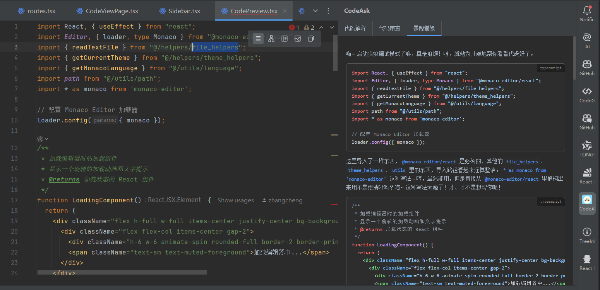

# CodeAsk-JB
## Introduction
<!-- Plugin description -->
CodeAsk-JB is an extension plugin for JetBrains Integrated Development Environments (IDEs). It needs to be used in conjunction with the main program [CodeAsk](https://github.com/woniu9524/CodeAsk). This plugin integrates the code analysis results generated by CodeAsk directly into JetBrains IDEs, providing real-time code interpretation capabilities.
<!-- Plugin description end -->

## Usage Instructions

### Prerequisites
1. Ensure that code analysis data has been generated using CodeAsk.
2. Open the project you wish to analyze in your IDE.

### Basic Operations
- Click on the `CodeAsk` icon in the right-hand panel to open the sidebar and view the analysis.

## Installation Guide

### Method 1: Install via IDE Plugin Marketplace
1. Open Settings Panel  
   `File` > `Settings` (Windows/Linux)  
   or `IntelliJ IDEA` > `Preferences` (macOS)

2. Navigate to Plugin Management  
   Select `Plugins` > Click on the `Marketplace` tab.

3. Search for Plugin  
   Enter `CodeAsk` in the search bar.

4. Install and Restart  
   Click the `Install` button, and restart the IDE after installation is complete.

### Method 2: Manual Installation via GitHub (Suitable for Users on Intranet)
1. Download the Latest Version  
   Visit the [Releases page](https://github.com/woniu9524/codeask-jb/releases/latest)  
   Download the `codeask-jb-x.x.x.jar` file.

2. Install the Plugin  
   Go to `Settings` > `Plugins` > Gear Icon > `Install Plugin from Disk...`  
   Select the downloaded file and restart the IDE.